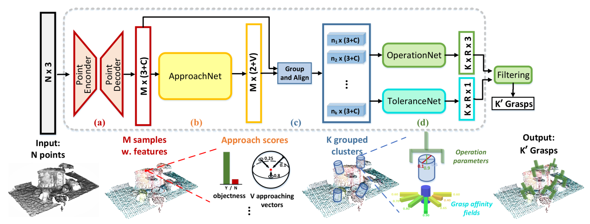
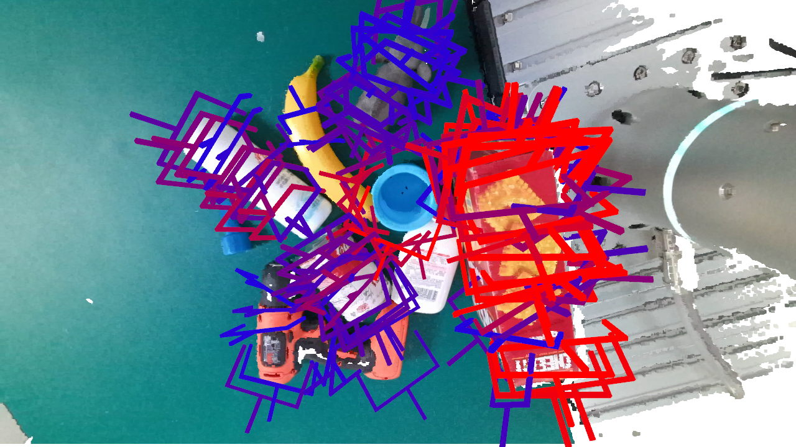

# GraspNet Baseline
An unofficial implementation of "GraspNet-1Billion: A Large-Scale Benchmark for General Object Grasping" (CVPR 2020).

[[paper](https://openaccess.thecvf.com/content_CVPR_2020/papers/Fang_GraspNet-1Billion_A_Large-Scale_Benchmark_for_General_Object_Grasping_CVPR_2020_paper.pdf)]
[[dataset](https://graspnet.net/)]
[[API](https://github.com/graspnet/graspnetAPI)]
[[doc](https://graspnetapi.readthedocs.io/en/latest/index.html)]

<div align="center">    
    
    
    
    <br> Top 50 grasps detected by our baseline model.
</div>


## Myhardware environment
- NVIDIA RTX 4090
- Ubuntu
- anaconda 3
- CUDA 11.3
## Requirements
- Python 3.8
- PyTorch 1.12
- Open3d 0.15.2
- TensorBoard 2.3
- NumPy 1.23.5
- SciPy 1.10.1
- Pillow 10.2.0
- tqdm 4.66.1

## Installation
1、Get the code.
```bash
https://github.com/kafei123456/graspnet-baseline-cuda11.3.git
cd graspnet-baseline-cuda11.3
```
2、Compile and install pointnet2 operators (code adapted from [votenet](https://github.com/facebookresearch/votenet)).
```bash
cd pointnet2
python setup.py install
```
3、Compile and install knn operator (code adapted from [knn_cuda](https://github.com/unlimblue/KNN_CUDA)).
```bash
cd KNN_CUDA
make && make install
```
4、Install graspnetAPI for evaluation.
```bash
git clone https://github.com/graspnet/graspnetAPI.git
cd graspnetAPI
pip install .
```

## Training and Testing
Training examples are shown in [command_train.sh](command_train.sh). `--dataset_root`, `--camera` and `--log_dir` should be specified according to your settings. You can use TensorBoard to visualize training process.

Testing examples are shown in [command_test.sh](command_test.sh), which contains inference and result evaluation. `--dataset_root`, `--camera`, `--checkpoint_path` and `--dump_dir` should be specified according to your settings. Set `--collision_thresh` to -1 for fast inference.

The pretrained weights can be downloaded from:

- `checkpoint-rs.tar`
[[Google Drive](https://drive.google.com/file/d/1hd0G8LN6tRpi4742XOTEisbTXNZ-1jmk/view?usp=sharing)]
[[Baidu Pan](https://pan.baidu.com/s/1Eme60l39tTZrilF0I86R5A)]
- `checkpoint-kn.tar`
[[Google Drive](https://drive.google.com/file/d/1vK-d0yxwyJwXHYWOtH1bDMoe--uZ2oLX/view?usp=sharing)]
[[Baidu Pan](https://pan.baidu.com/s/1QpYzzyID-aG5CgHjPFNB9g)]

`checkpoint-rs.tar` and `checkpoint-kn.tar` are trained using RealSense data and Kinect data respectively.

## Demo
A demo program is provided for grasp detection and visualization using RGB-D images. You can refer to [command_demo.sh](command_demo.sh) to run the program. `--checkpoint_path` should be specified according to your settings (make sure you have downloaded the pretrained weights, we recommend the realsense model since it might transfer better). The output should be similar to the following example:

<div align="center">    
    
</div>

__Try your own data__ by modifying `get_and_process_data()` in [demo.py](demo.py). Refer to [doc/example_data/](doc/example_data/) for data preparation. RGB-D images and camera intrinsics are required for inference. `factor_depth` stands for the scale for depth value to be transformed into meters. You can also add a workspace mask for denser output.

## Some Tips
Some solutions to errors：

1、AttributeError: module 'numpy' has no attribute 'float'.`np.float` was a deprecated alias for the builtin `float`. To avoid this error in existing code, use `float` by itself. Doing this will not modify any behavior and is safe. If you specifically wanted the numpy scalar type, use `np.float64` here.
```
solution: pip install numpy==1.23.5        
```

## Citation
Thanks for the following excellent work：
```
https://github.com/unlimblue/KNN_CUDA
https://github.com/graspnet/graspnet-baseline
```
